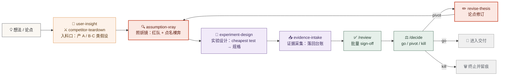

<div align="center">


# Reckoner

### 会顶嘴、有记忆的决策内核

给主观、可刷、易自欺的产品决策，<br>装一个**不附和、会积累**的决策 OS。

[](https://github.com/LuckyOneTwoThree/reckoner/actions/workflows/ci.yml)
[](https://github.com/LuckyOneTwoThree/reckoner)
[](https://github.com/LuckyOneTwoThree/reckoner/tree/main/skills)
[](https://github.com/LuckyOneTwoThree/reckoner/tree/main/commands)
[](https://github.com/LuckyOneTwoThree/reckoner/tree/main/kernel)
[](LICENSE)

```
git clone → /new my-project → @assumption-xray → 被顶回来
```

</div>

---


> **一句话**：其他 AI 在想「怎么让你爽」，Reckoner 在想「怎么让你不出丑」。
> 照妖镜（assumption-xray）只是入口；真正留住你的是**内核**与**跨项目校准**。

<details>
<summary><strong>English TL;DR</strong></summary>

**Reckoner** is a decision OS for product managers that refuses to flatter you. Every skill run writes its conclusions back into a durable kernel (`thesis` + `assumption-ledger`), so your assumptions, evidence, and expiry dates survive across sessions. It red-teams your ideas (the "照妖镜 / assumption-xray" skill), designs the cheapest possible test, ingests evidence, and forces a sign-off before any build decision. Deterministic scripts (`validate.mjs`) enforce schema and trust ceilings; the LLM only judges. 6 skills, 6 commands, schema-hard-validated memory.

</details>

---

## 🎯 为什么做这个

产品决策天然主观、容易被自己「刷」出信心、容易自欺。现有 AI PM 助手大多是**无状态文档生成器**，Reckoner 正面直击三大反模式：

> ### 🧠 没记忆
> 每次对话从零开始，上次的假设和证据全部丢失。
> **→ Reckoner：有记忆** — 结论回写内核，跨会话留存，可被反事实回看。

> ### 🤝 会谄媚
> 倾向附和，不会真的顶你。
> **→ Reckoner：会顶嘴** — 默认「风险是真的」，先 steelman 再攻击。

> ### 📄 散落结论
> 结论散落在文档里，无法积累成判断资产。
> **→ Reckoner：可追溯** — 假设-证据-决策显式化为链路。

---

## ⚡ 30 秒感受一下：照妖镜怎么顶你

**你说**：「做个 AI 记账 App，主打自动分类，大家都嫌手动记账烦。」

<table>
<tr>
<th width="42%">普通 AI 助手</th>
<th width="58%">Reckoner（照妖镜）</th>
</tr>
<tr>
<td valign="top">

「这个方向很棒！自动分类确实是刚需，建议再加上预算提醒、月度报表和多账户支持，打造一站式记账体验……」

<sub>全是附和。没人在意「用户为什么不肯连银行卡」。</sub>

</td>
<td valign="top">

**🩲 裸奔假设 A-01**&nbsp;&nbsp;<sub>影响高 × 证据 L1</sub>

用户愿意为"自动分类"授权银行数据、放弃手动掌控感

- **Fails if**：访谈 10 人 <3 人愿意连银行卡
- **最便宜验证**：5 人看假界面问"你会连吗"（0 成本 / 1 天）
- **Kill 标准**：连接意愿 <30% → 整个方向重估

**⚔️ 最致命追问**

分类准确率只有 80% 时，用户觉得"省事"还是"更不放心"？
—— 这决定了你是**提效工具**还是**焦虑放大器**。

</td>
</tr>
</table>

> 这一块的转化力超过后面所有架构表格的总和：把「会顶嘴 / 裸奔 / cheapest test / kill 标准」一次性变成你能感受到的真实价值。

---

## 🔁 决策回路



> **人话翻译**：红队 → 最便宜实验 → 证据落账 → 人工签收 → 决策收口 → 必要时修订论点、重新红队。
> **回路外产出**：`/decide go` 之后才允许进入交付（造产品 / 写 PRD / 排期）。这些产出属"回路外补充件"，写入 `workspace/<项目>/artifacts/`（约定见 AGENTS.md），**不入内核 schema、不经 validate**——和 `decisions.md` 同级逻辑。

---

## 📦 安装

```bash
git clone https://github.com/LuckyOneTwoThree/reckoner.git
cd reckoner
```

**方式 1 · Claude Code / Cowork（推荐）** — `skills/` 与 `/命令` 原生自动发现，直接 `@assumption-xray` / `/new`；也可作为 Claude 插件按 `.claude-plugin/marketplace.json` 接入。

**方式 2 · Codex** — 在对话里说「读 AGENTS.md 建立上下文」，skill 通过读对应 `SKILL.md` 执行，脚本通过 shell 跑。

**前置** — Node ≥ 20（仅 `tools/*.mjs` 与 `node --test` 需要）。

---

## 🚀 快速开始

> 在 agent 工具里你**说人话就行**，下面的命令是 agent 替你跑的（也可手动跑）。

| # | 你说 / 你跑 | 会发生什么 | 回路下一站 |
|:-:|---|---|---|
| 1 | 「建个项目 X」或 `/new` <br><sub>`node tools/new-project.mjs <项目名>`</sub> | 生成 `workspace/<项目名>/{thesis.md, ledger.json, sources/}` | 填 thesis 六格 |
| 2 | 打开 `thesis.md` 填写六格论点 | 北极星持久化，必须可证伪 | `@assumption-xray` |
| 3 | `@assumption-xray <你的想法或论点>` | 红队表 + 点名裸奔 + 每条最便宜验证 | `@experiment-design` |
| 4 | `@experiment-design` | 最便宜验证落成可追踪实验规格，`status→testing` | 跑实验 |
| 5 | `@evidence-intake <访谈 / 竞品 / 数据 / 链接>` | 归档 `sources/`、升降级台账 | `/review` |
| 6 | `/review`（每周） | 批量确认强声明 sign-off | `/decide` |
| 7 | `/decide` | go / pivot / kill 收口；pivot → `@revise-thesis` | go→交付 / pivot→闭合 |
| 8 | `node tools/validate.mjs workspace/<项目名>/ledger.json` | 校验内核 + 打印 `👉 下一步` | 跟着提示走 |

---

## 🧰 能力清单

> 注：**照妖镜** 是 `assumption-xray` 这一个 skill 的昵称，仅在该 skill 语境下使用。

### Skills

| Skill | 触发 | 主要产出 |
|---|---|---|
| **assumption-xray** <sub>照妖镜 · 主角</sub> | `@assumption-xray <想法>` | A/B/C/D 拆解 + 🩲 裸奔排序 + ⚔️ 最致命追问 + 每条 Fails if / 最便宜验证 / kill 标准 |
| **user-insight** | `@user-insight <访谈/反馈>` | 2–4 个洞察主题 + 可证伪 A 类假设 |
| **competitor-teardown** | `@competitor-teardown <竞品>` | 竞品矩阵（含「现状凑合方案」）+ 市场缺口 → B/C 类假设 |
| **evidence-intake** | `@evidence-intake <证据>` | 归档 sources/ + 升降级台账 + 触发反驳循环 |
| **experiment-design** | `@experiment-design` | 把最便宜验证落成可追踪实验规格，`status → testing` |
| **revise-thesis** | `@revise-thesis` | 结构化修订论点，追加 `thesis.revisions[]`，闭合循环 |

### Commands

| 命令 | 作用 |
|---|---|
| `/new` | 一键初始化项目（slug 化命名 + 重名保护） |
| `/list` | 列出所有项目 + 各自裸奔假设数 / 待 sign-off 数 |
| `/review` | 批量 sign-off（扫描 ≥L3 或状态终局且未签字项） |
| `/decide` | go / pivot / kill 决策日志（写 `decisions.md`，不入 schema） |
| `/retro` | 复盘决策校准（取 git-SHA 快照对照当时假设分布 vs 现在结果） |
| `/lookup` | 跨项目查历史教训（扫全 workspace 按关键词/type/status 检索） |

> **不是 prompt 拼装**：每个 skill 配 5 条 eval，内核数据过 `validate.mjs` 硬校验（可靠度越级直接 exit 1）。LLM 只负责判断，纪律交给确定性脚本。

---

<details open>
<summary><strong>🧠 想深入？核心概念 · 数据契约 · 设计哲学</strong></summary>

## 核心概念

> ### ⚖️ 第一原则：LLM 负责判断，脚本负责纪律。
> LLM 做拆解、攻击、归类、写作；确定性的校验、ID 分配、上限约束交给 `tools/*.mjs`。二者不互相替代。

### 两个内核对象

| 对象 | 角色 | 说明 |
|---|---|---|
| 🧭 **thesis** | 北极星 | 必须可被证伪的陈述：目标用户 / 核心问题 / 解法假设 / 为什么现在 / 成功信号 |
| 💓 **assumption-ledger** | 心脏 | 把论点拆解为可验证假设，分类管理、分级留存——决策内核最核心的对象 |

### 四类假设 · A / B / C / D

| 类型 | 含义 | 回答的问题 |
|:-:|---|---|
| **A** | 用户价值 | 用户真的有这个痛点、愿意为此改变行为吗？ |
| **B** | 商业可行 | 这个模式能赚钱、单位经济成立吗？ |
| **C** | 技术可行 | 我们能做出来、性能/成本/集成可行吗？ |
| **D** | 安全合规 | 能上线吗？会触犯监管吗？数据合规吗？ |

### 证据分级 · L1 → L4

可靠度上限硬约束：`evidenceLevel` 不得高于来源 `reliability` 的上限。违反由 `validate.mjs` 判校验失败（exit 1）。

| 等级 | 含义 | 来源上限 | 可信度 |
|:-:|---|:-:|---|
| **L1** | 只是觉得 | `self` | ●○○○ |
| **L2** | 间接信号 | `indirect` | ●●○○ |
| **L3** | 直接证据 | `direct` | ●●●○ |
| **L4** | 数据验证 | `data` | ●●●● |

### 其他关键机制

> **🩲 裸奔假设** = 影响高 × 证据弱
> validator 自动判定、不落盘——最该优先验证的对象。

> **✅ 分级 sign-off**
> 弱证据 / 结构改动自动落库；`≥L3` 或 `status` 变更需人工确认（`/review`）。

> **🔁 活的闭环**
> 承重假设被推翻 → 论点自动标 `needsRevision` → 修订留痕（`thesis.revisions[]`）。

## 目录结构

<table>
<tr>
<td width="50%" valign="top">

**🧠 kernel/** — 决策内核（真 IP）

- `thesis.schema.json`
- `assumption-ledger.schema.json`
- `writeback-contract.md` <sub>回写规范 + 分级 sign-off + 循环状态机</sub>
- `templates/thesis.md`

</td>
<td width="50%" valign="top">

**🛠 skills/** — 6 个原子能力

- `assumption-xray` <sub>假设红队（照妖镜）</sub>
- `user-insight` <sub>产 A 类假设</sub>
- `competitor-teardown` <sub>产 B/C 类假设</sub>
- `experiment-design` <sub>cheapest test → 规格</sub>
- `evidence-intake` <sub>落回台账</sub>
- `revise-thesis` <sub>闭合循环</sub>

</td>
</tr>
<tr>
<td width="50%" valign="top">

**⚙️ tools/** — 零依赖脚本

- `new-project.mjs` <sub>初始化</sub>
- `validate.mjs` <sub>唯一确定性纪律闸：schema + 信任 + ID 护栏</sub>
- `migrate.mjs` <sub>schemaVersion 迁移（4.0→4.1）</sub>
- `lookup.mjs` <sub>跨项目检索（无状态）</sub>

</td>
<td width="50%" valign="top">

**📜 commands/** — 6 个斜杠命令

`/new` · `/list` · `/review`
`/decide` · `/retro` · `/lookup`

**agent 约定**

- `AGENTS.md` <sub>Codex 约定读</sub>
- `CLAUDE.md` <sub>指向 AGENTS.md（Claude Code 约定读）</sub>
- `.claude-plugin/marketplace.json`
- `docs/ARCHITECTURE.md` <sub>锁定版设计说明</sub>

</td>
</tr>
</table>

> `workspace/<project>/` 是用户 runtime 数据（gitignored，不入库）——跑 `/new` 后生成，每个项目一个隔离文件夹。

## 内核数据契约

<table>
<tr>
<td width="50%" valign="top">

**🧭 thesis** — 产品论点

```yaml
id: T-NN
schemaVersion: "4.1"
statement: 必须可证伪
targetUser: ...
coreProblem: ...
solutionHypothesis: ...
whyNow: ...
successSignal: ...
needsRevision: false   # 承重假设被推翻时自动置位
bizModel: ...          # 4.1 新增 optional
stage: ...             # 用于 /lookup 跨项目维度硬标记
revisions: []          # 唯一 history 机制
createdAt: ISO8601
```

</td>
<td width="50%" valign="top">

**💓 assumption-ledger** — 假设台账

```yaml
id: <TYPE>-NN          # 脚本自动分配
type: A | B | C | D
statement: ...
impact: high | med | low
evidenceLevel: L1-L4
status: todo | testing | validated | refuted
failsIf: ...
cheapestTest: ...
killCriteria: ...
provenance:
  reliability: self | indirect | direct | data
  source: ...
  signedOffBy: null
  signedOffAt: null
freshness:
  lastVerified: ISO8601
  ttlDays: 30
```

</td>
</tr>
</table>

> **派生字段**（不落盘，validator 现算）：`isNaked`（裸奔）· `stale`（过期）
>
> **回路外补充件**（不入 schema、不经 validate）：
> - `decisions.md` — `/decide` 的纯 append 决策日志
> - `artifacts/` — `/decide go` 后的产品交付物（PRD / 商业分析等）

## 在 Agent 工具里怎么用

| 工具 | 发现方式 |
|---|---|
| **Claude Code / Cowork** | `skills/` 与斜杠命令原生自动发现，直接 `@assumption-xray` / `/new` |
| **Codex** | 先读根目录 `AGENTS.md` 建立上下文；skill 通过读对应 `SKILL.md` 执行，脚本通过 shell 跑 |

> 命令行是**确定性脊椎**（护栏），agent 是**友好门面**——你只碰门面。

## 设计哲学

<table>
<tr>
<td width="33%" valign="top" align="center">

### ⚔️
**对抗而非附和**

默认「风险是真的」，先 steelman 再攻击，不打稻草人，也不制造虚假怀疑

</td>
<td width="33%" valign="top" align="center">

### 🛡
**可信的记忆才值得留存**

不可信的记忆比没有记忆更糟，所以有信任分级 + 确定性校验硬闸

</td>
<td width="33%" valign="top" align="center">

### 🎯
**精简优先**

P0 只做被真实用到的东西，一切「看起来更完整」的层都推迟到有触发条件时再建

</td>
</tr>
</table>

## 血统

<table>
<tr>
<td width="50%" valign="top">

**🫀 魂** · 来自作者的产品方法论

- 决策内核
- A/B/C/D 四类假设
- L1–L4 证据
- 对抗哲学
- 回写沉淀 · 决策校准

</td>
<td width="50%" valign="top">

**🔧 手艺** · 借鉴主流 AI skill 工程

- `SKILL.md` frontmatter 规范
- steelman-再攻击
- 影响×可能性×成本排序
- eval 纪律

</td>
</tr>
</table>

两边都**不整包照抄**：方法论抽内核不搬长文；skill 工程抄结构不抄广度。

## 多项目

一套框架多项目并存：`skills/` `kernel/` `tools/` 共享，`workspace/<项目>/` 隔离状态，ID 项目内编号、互不冲突。跨项目学习（`kernel/personal/`）为 Phase 1.5，纯增益、不冲突。

## 路线图

| 阶段 | 状态 | 内容 |
|---|:-:|---|
| **P0**（本仓库） | ✅ shipped | thesis + ledger 两对象 + 6 skill + 6 命令 + validator + 项目初始化 + agent 约定。回路闭合：照妖镜 → 实验设计 → 证据采集 → review → decide → 论点修订；/retro 复盘校准；/lookup 跨项目检索 |
| **Phase 1.5** | ⏳ pending | OST（机会方案树）；`/retro` + `/lookup` 已下移至 P0 |
| **Phase 2** | 🔮 future | Web 体检仪表盘（内核数据稳定、需要可视化留存时） |

## 校验与质量

`tools/validate.mjs`（唯一确定性代码，零依赖）

- **对 `ledger.json` 全校验** — 枚举校验、可靠度上限、ID 自动分配 `<TYPE>-NN`、计算 `isNaked`/`stale`、标记待 sign-off、错误 `exit 1`
- **对 `thesis.md` 分层执法** — 扁平标量字段（`schemaVersion=4.1` / `id=T-NN` / `needsRevision=bool`）**硬失败 exit 1**；嵌套字段（`revisions[]`）软警告；schemaVersion=4.0 软警告+迁移提示
- **启发式下一步提示** — 校验通过后打印 `👉 下一步`（有裸奔→`@experiment-design`/`@evidence-intake`；`needsRevision`→`@revise-thesis`；待 sign-off→`/review`；全清→`/decide`）

**eval 纪律** — 6 个 skill 各有 5 条 eval（含 ✅/❌ 对照 + 标"最关键"条），覆盖入料口、红队关口、实验设计、收口、闭合全回路节点。想看 → `skills/<name>/eval.md`

</details>

---

<div align="center">


**会顶嘴 · 有记忆 · 可追溯**

<sub>你的 PM 决策需要被红队，就像你的代码需要单测。</sub>

<sub>Reckoner · MIT License · Node ≥ 20</sub>

</div>
