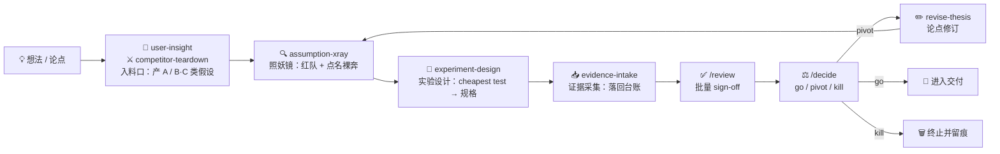

<div align="center">

# playbook

**会顶嘴、有记忆的决策内核**

给主观、可刷、易自欺的产品决策，装一个不附和、会积累的决策 OS。

[]()
[]()
[]()
[]()
[](https://github.com/LuckyOneTwoThree/pm-playbook)

</div>

---

> 照妖镜是钩子，内核是留存，跨项目校准是护城河。
> 它不是无状态的文档生成器，是一个会积累的决策 OS。

## 为什么

产品决策天然主观、容易被自己「刷」出信心、容易自欺。现有 AI PM 助手大多是**无状态文档生成器**，playbook 正面直击三大反模式：

| 反模式 | playbook 的解法 |
| --- | --- |
| 每次对话从零开始，不记得上次的假设和证据 | **有记忆** — 结论回写内核，跨会话留存 |
| 倾向附和（谄媚），不会真的顶你 | **会顶嘴** — 默认「风险是真的」，先 steelman 再攻击 |
| 结论散落在文档里，无法积累成判断资产 | **可追溯** — 假设-证据-决策显式化为链路 |

## 核心概念

> **第一原则**：LLM 负责判断，脚本负责纪律。
> LLM 做拆解、攻击、归类、写作；确定性的校验、ID 分配、上限约束交给 `tools/*.mjs`。二者不互相替代。

### 两个内核对象

| 对象 | 角色 | 说明 |
| --- | --- | --- |
| **thesis** | 北极星 | 必须可被证伪的陈述：目标用户 / 核心问题 / 解法假设 / 为什么现在 / 成功信号 |
| **assumption-ledger** | 心脏 | 把论点拆解为可验证假设，分类管理、分级留存——决策内核最核心的对象 |

### 四类假设 · A / B / C / D

| 类型 | 含义 | 回答的问题 |
| --- | --- | --- |
| **A** | 用户价值 | 用户真的有这个痛点、愿意为此改变行为吗？ |
| **B** | 商业可行 | 这个模式能赚钱、单位经济成立吗？ |
| **C** | 技术可行 | 我们能做出来、性能/成本/集成可行吗？ |
| **D** | 安全合规 | 能上线吗？会触犯监管吗？数据合规吗？ |

### 证据分级 · L1 → L4

可靠度上限硬约束：`evidenceLevel` 不得高于来源 `reliability` 的上限。违反由 `validate.mjs` 判校验失败（exit 1）。

| 等级 | 含义 | 来源上限 |
| --- | --- | --- |
| **L1** | 只是觉得 | `self` |
| **L2** | 间接信号 | `indirect` |
| **L3** | 直接证据 | `direct` |
| **L4** | 数据验证 | `data` |

### 其他关键机制

- **裸奔假设** = 影响高 × 证据弱（validator 自动判定，不落盘）——最该优先验证的对象
- **分级 sign-off** — 弱证据 / 结构改动自动落库；`≥L3` 或 `status` 变更需人工确认（`/review`）
- **活的闭环** — 承重假设被推翻 → 论点自动标 `needsRevision` → 修订留痕（`thesis.revisions[]`）

## 决策回路



> **回路外产出**：`/decide go` 之后才允许进入交付（造产品 / 写 PRD / 排期）。这些产出属"回路外补充件"，写入 `workspace/<项目>/artifacts/`（约定见 AGENTS.md），**不入内核 schema、不经 validate**——和 `decisions.md` 同级逻辑。

## 快速开始

> 在 agent 工具里你**说人话就行**，下面的命令是 agent 替你跑的（也可手动跑）。

```bash
# 1. 加载本仓库（agent 会先读 AGENTS.md 建立上下文）

# 2. 新建项目
node tools/new-project.mjs <项目名>      # 或在 agent 里 /new
# → 自动生成 workspace/<项目名>/{thesis.md, ledger.json, sources/}

# 3. 打开 thesis.md 填写六格论点
# 4. 召唤照妖镜
@assumption-xray <你的想法或论点>

# 5. 设计实验
@experiment-design                       # 把最便宜验证落成可追踪实验规格, status→testing

# 6. 跑完实验 → 采集证据
@evidence-intake <访谈 / 竞品 / 数据 / 链接>

# 7. 每周批量确认强声明
/review

# 8. 收口决策
/decide                                  # go / pivot / kill; pivot → @revise-thesis

# 9. 校验内核
node tools/validate.mjs workspace/<项目名>/ledger.json
# validator 会提示下一步该跑哪个 skill
```

## 能力清单

### Skills

| Skill | 触发 | 主要产出 |
| --- | --- | --- |
| **assumption-xray** · 照妖镜（主角） | `@assumption-xray <想法>` | A/B/C/D 拆解 + 裸奔排序 + 最致命追问 + 每条 Fails if / 最便宜验证 / kill 标准 |
| **user-insight** | `@user-insight <访谈/反馈>` | 2–4 个洞察主题 + 可证伪 A 类假设 |
| **competitor-teardown** | `@competitor-teardown <竞品>` | 竞品矩阵（含「现状凑合方案」）+ 市场缺口 → B/C 类假设 |
| **evidence-intake** | `@evidence-intake <证据>` | 归档 sources/ + 升降级台账 + 触发反驳循环 |
| **experiment-design** | `@experiment-design` | 把最便宜验证落成可追踪实验规格，`status → testing` |
| **revise-thesis** | `@revise-thesis` | 结构化修订论点，追加 `thesis.revisions[]`，闭合循环 |

### Commands

| 命令 | 作用 |
| --- | --- |
| `/new` | 一键初始化项目（slug 化命名 + 重名保护） |
| `/list` | 列出所有项目 + 各自裸奔假设数 / 待 sign-off 数 |
| `/review` | 批量 sign-off（扫描 ≥L3 或状态终局且未签字项） |
| `/decide` | go / pivot / kill 决策日志（写 `decisions.md`，不入 schema） |

## 目录结构

```
playbook/
├─ README.md
├─ AGENTS.md                    # agent 操作约定（Codex 约定读）
├─ CLAUDE.md                    # 指向 AGENTS.md（Claude Code 约定读）
├─ .claude-plugin/marketplace.json
├─ kernel/                      # 决策内核：数据模型 + 契约（真 IP）
│  ├─ thesis.schema.json
│  ├─ assumption-ledger.schema.json
│  ├─ writeback-contract.md     # 回写规范 + 分级 sign-off + 循环状态机
│  └─ templates/thesis.md
├─ skills/                      # 6 个原子能力，独立可触发
│  ├─ assumption-xray/          # 假设红队（照妖镜）
│  ├─ user-insight/             # 用户洞察（产 A 类假设）
│  ├─ competitor-teardown/      # 竞品拆解（产 B/C 类假设）
│  ├─ evidence-intake/          # 证据采集（落回台账）
│  ├─ experiment-design/        # 实验设计（cheapest test → 规格）
│  └─ revise-thesis/            # 论点修订（闭合循环）
├─ commands/
│  ├─ new.md · list.md · review.md · decide.md
├─ tools/
│  ├─ new-project.mjs           # 初始化脚本（零依赖）
│  └─ validate.mjs              # 唯一代码：schema + 信任 + ID 护栏
├─ workspace/                   # 用户工作区（gitignored，不入库——runtime 数据）
│  └─ <project>/                # 跑 /new 后生成，每个项目一个隔离文件夹
└─ docs/ARCHITECTURE.md         # 锁定版设计说明
```

## 内核数据契约

**thesis**（产品论点）

`id`（`T-NN`）· `schemaVersion`（`"4.1"`）· `statement` · `targetUser` · `coreProblem` · `solutionHypothesis` · `whyNow` · `successSignal` · `needsRevision`（bool，承重假设被推翻时自动置位）· `bizModel`/`stage`（4.1 新增 optional,用于 /lookup 跨项目维度硬标记）· `revisions[]`（唯一 history 机制）· `createdAt`

**assumption-ledger**（假设台账）

`id`（`<TYPE>-NN`）· `type`（A/B/C/D）· `statement` · `impact`（high/med/low）· `evidenceLevel`（L1–L4）· `status`（todo/testing/validated/refuted）· `failsIf` · `cheapestTest` · `killCriteria` · `provenance{ reliability, source, signedOffBy, signedOffAt }` · `freshness{ lastVerified, ttlDays }`

派生字段（不落盘，validator 现算）：`isNaked`（裸奔）· `stale`（过期）

**回路外补充件**（不入 schema、不经 validate）

- `decisions.md` — `/decide` 的纯 append 决策日志
- `artifacts/` — `/decide go` 后的产品交付物（PRD / 商业分析等）

## 在 Agent 工具里怎么用

| 工具 | 发现方式 |
| --- | --- |
| **Claude Code / Cowork** | `skills/` 与斜杠命令原生自动发现，直接 `@assumption-xray` / `/new` |
| **Codex** | 先读根目录 `AGENTS.md` 建立上下文；skill 通过读对应 `SKILL.md` 执行，脚本通过 shell 跑 |

> 命令行是**确定性脊椎**（护栏），agent 是**友好门面**——你只碰门面。

## 设计哲学

- **对抗而非附和** — 默认「风险是真的」，先 steelman 再攻击，不打稻草人，也不制造虚假怀疑
- **可信的记忆才值得留存** — 不可信的记忆比没有记忆更糟，所以有信任分级 + 确定性校验硬闸
- **精简优先** — P0 只做被真实用到的东西，一切「看起来更完整」的层都推迟到有触发条件时再建

## 血统

> **魂** · 来自作者的产品方法论
> 决策内核、A/B/C/D 四类假设、L1–L4 证据、对抗哲学、回写沉淀、决策校准

> **手艺** · 借鉴主流 AI skill 工程
> `SKILL.md` frontmatter 规范、steelman-再攻击、影响×可能性×成本排序、eval 纪律

两边都**不整包照抄**：方法论抽内核不搬长文；skill 工程抄结构不抄广度。

## 多项目

一套框架多项目并存：`skills/` `kernel/` `tools/` 共享，`workspace/<项目>/` 隔离状态，ID 项目内编号、互不冲突。跨项目学习（`kernel/personal/`）为 Phase 1.5，纯增益、不冲突。

## 路线图

| 阶段 | 内容 |
| --- | --- |
| **P0**（本仓库） | thesis + ledger 两对象 + 6 skill + 6 命令 + validator + 项目初始化 + agent 约定。回路闭合：照妖镜 → 实验设计 → 证据采集 → review → decide → 论点修订；/retro 复盘校准；/lookup 跨项目检索 |
| **Phase 1.5** | OST（机会方案树）；`/retro` + `/lookup` 已下移至 P0 |
| **Phase 2** | Web 体检仪表盘（内核数据稳定、需要可视化留存时） |

## 校验与质量

`tools/validate.mjs`（唯一确定性代码，零依赖）

- **对 `ledger.json` 全校验** — 枚举校验、可靠度上限、ID 自动分配 `<TYPE>-NN`、计算 `isNaked`/`stale`、标记待 sign-off、错误 `exit 1`
- **对 `thesis.md` 分层执法** — 扁平标量字段（`schemaVersion=4.1` / `id=T-NN` / `needsRevision=bool`）**硬失败 exit 1**；嵌套字段（`revisions[]`）软警告；schemaVersion=4.0 软警告+迁移提示
- **启发式下一步提示** — 校验通过后打印 `👉 下一步`（有裸奔→`@experiment-design`/`@evidence-intake`；`needsRevision`→`@revise-thesis`；待 sign-off→`/review`；全清→`/decide`）

**eval 纪律** — 6 个 skill 各有 5 条 eval（含 ✅/❌ 对照 + 标"最关键"条），覆盖入料口、红队关口、实验设计、收口、闭合全回路节点。

---

<div align="center">

<sub>playbook · 决策 OS for PM</sub>

</div>
